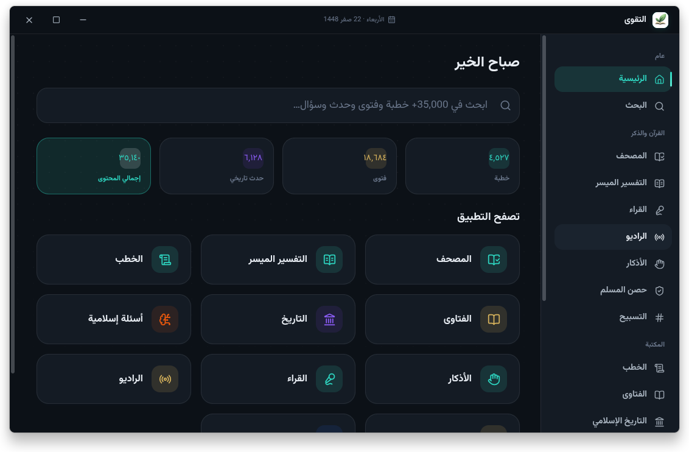
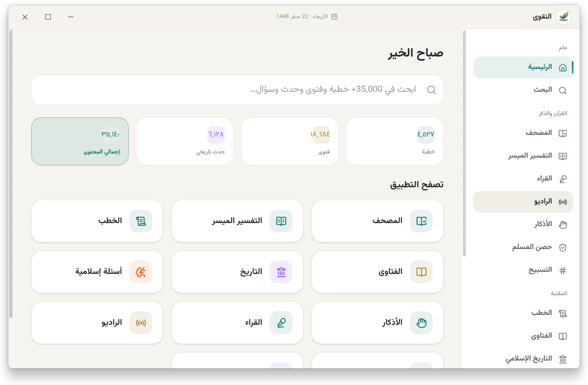

# التقوى — Altaqwaa


تطبيق إسلامي لسطح المكتب — **مصحف ومكتبة إسلامية شاملة** تعمل دون اتصال بالإنترنت، مبني بـ **Electron + React**، مجاني ومفتوح المصدر إلى الأبد بموجب رخصة **GPL-3.0**.

Altaqwaa is an offline-first Islamic desktop application: a full Quran, adhkar, Hisn al-Muslim, prayer times, and a 35,000+ item library (khutbahs, fatwas, books, Islamic history, quizzes) — all running locally on your device. No accounts, no tracking, no servers.

المستودع الرسمي: **[github.com/rn0x/altaqwaa-desktop](https://github.com/rn0x/altaqwaa-desktop)**

---

## لقطات الشاشة

| الوضع الليلي | الوضع النهاري |
|---|---|
|  |  |

---

## المميزات

- **المصحف كاملاً** — نص بخط عثماني (مجمع الملك فهد)، مع التحكم بحجم الخط ووضع القراءة المريح
- **التفسير الميسر** — تفسير معاصر لكل آية، بجانب الآية مباشرة
- **الأذكار** — أذكار الصباح والمساء مع تذكيرات صوتية في الأوقات المحددة
- **حصن المسلم** — الأذكار والأدعية حسب الموقف، منقحة
- **مواقيت الصلاة** — حساب محلي بـ 10 طرق حسابية (لا يُرسل موقعك لأي جهة)، مع تحديد الموقع يدوياً أو عبر GPS
- **الأذان** — تنبيه وصوت الأذان عند دخول الوقت، مع خيار إضافة صوت أذان من جهازك
- **المسبحة** — تسبيح مع إحصائيات يومية وشهرية وسنوية، وأذكار مخصصة
- **المكتبة** — أكثر من 35,000 مادة: خطب، فتاوى، كتب، تاريخ إسلامي، أسئلة ومسابقات، تنقّب بذكاء
- **القراء** — تلاوات بث مباشر، أو تحميل محلي للاستماع بدون إنترنت
- **إذاعات قرآنية** — بث مباشر لقنوات قرآنية متعددة 177 إذاعة
- **بحث عربي ذكي** — تصحيح إملائي، اقتراحات، وترجيح دلالي (BM25) على كامل المكتبة
- **الوضع الليلي والنهاري** — تصميم عربي RTL أنيق مع وضعين كاملين
- **الخصوصية أولاً** — كل البيانات محلية: لا حسابات، لا تتبع، لا خوادم طرف ثالث
- **فحص التحديثات تلقائياً** — يتحقق من إصدار جديد من المستودع الرسمي على GitHub ويخبرك عند توفره

---

## التنزيل

### Linux

| الطريقة | الأمر |
|---|---|
| **Snap** | `sudo snap install altaqwaa` — [snapcraft.io/altaqwaa](https://snapcraft.io/altaqwaa) |
| **Flatpak** | `flatpak install flathub org.altaqwaa.Altaqwaa` — [flathub.org](https://flathub.org/en/apps/org.altaqwaa.Altaqwaa) |
| **AppImage / deb / rpm / flatpak / snap / Tar.gz** | من [صفحة الإصدارات](https://github.com/rn0x/altaqwaa-desktop/releases) — حمّل الملف المناسب لتوزيعتك وشغّله |

### Windows

- حمّل ملف **`setup.exe`** (تثبيت) أو **`portable.exe`** (محمول بدون تثبيت) من [صفحة الإصدارات](https://github.com/rn0x/altaqwaa-desktop/releases)

### من الكود المصدري

> **متطلب أساسي: [Git LFS](https://git-lfs.com)** — ملفات البيانات الكبيرة (القرآن، الخطب، الفتاوى) والصوتيات مخزنة في المستودع عبر Git LFS، فبدون تفعيله لن تُحمَّل هذه الملفات ولن يعمل التطبيق.

```bash
git lfs install                          # تفعيل Git LFS (مرة واحدة على جهازك)
git clone https://github.com/rn0x/altaqwaa-desktop.git
cd altaqwaa-desktop
npm install
npm start
```

> تثبيت Git LFS حسب توزيعتك:
> - **Fedora / RHEL**: `sudo dnf install git-lfs`
> - **Ubuntu / Debian**: `sudo apt install git-lfs`
> - **Arch**: `sudo pacman -S git-lfs`
> - **Windows / macOS**: حمّله من [git-lfs.com](https://git-lfs.com) أو عبر مدير الحزم (Homebrew / winget / Chocolatey)
>
> استنسخ المستودع وسيُحمَّل Git LFS الملفات تلقائياً. وللتحقق: `git lfs ls-files` يعرض الملفات المتعقبة.

---

## التطوير

المتطلبات: **Node.js 20+** و **npm** و **Git LFS** (لتحميل ملفات البيانات الكبيرة — راجع قسم «من الكود المصدري»).

```bash
npm install                # تثبيت الاعتماديات

npm run dev                # بيئة التطوير (الأفضل): Vite + Electron
                           #  · تعديلات الواجهة تنعكس فوراً (Hot Reload)
                           #  · أي تعديل في electron/** يعيد تشغيل Electron تلقائياً
npm run dev:renderer       # خادم Vite فقط (الواجهة)
npm run start              # تشغيل النسخة المبنية
npm test                   # تشغيل الاختبارات (27 اختباراً)
```

> المكتبة مرفقة كاملة وجاهزة (لقطة `resources/library/`): في أول تشغيل تُنسخ إلى بيانات المستخدم في الخلفية (استعادة فورية ~2 ثانية) — لا تُبنى ولا تحتاج إنترنت.

## البناء والتغليف

> **كل أمر تغليف يبني الواجهة (React) تلقائياً أولاً عبر `npm run build`** ثم يبدأ التغليف — لا داعي لبنائها يدوياً قبل كل أمر.

### المتطلبات

| الأداة | الغرض |
|---|---|
| **Node.js 20+** و **npm** | البناء والتغليف |
| **Git LFS** | تحميل ملفات البيانات الكبيرة (راجع قسم «من الكود المصدري») |
| **`libxcrypt-compat`** *(Fedora/RHEL فقط)* | ضروري لبناء حزم `deb` و `rpm` — يوفّر `libcrypt.so.1` التي تطلبها أداة `fpm` المرفقة: `sudo dnf install libxcrypt-compat`. **بدون صلاحيات sudo**: حمّل الحزمة واستخرجها محلياً: `dnf download libxcrypt-compat` ثم `rpm2cpio <الحزمة>.x86_64.rpm \| cpio -idm` وشغّل البناء مع `LD_LIBRARY_PATH=<المجلد>/usr/lib64` |
| **Wine** *(للبناء من لينكس فقط)* | ضروري لتضمين الأيقونة ومعلومات الإصدار في ملفات Windows: `sudo dnf install wine` — غير مطلوب إذا بنيت من Windows نفسه |
| **`flatpak` + `flatpak-builder`** *(لحزمة Flatpak فقط)* | `sudo dnf install flatpak flatpak-builder`، ثم ثبّت بيئة التشغيل (مرة واحدة): `flatpak install flathub org.freedesktop.Platform//24.08 org.freedesktop.Sdk//24.08 org.electronjs.Electron2.BaseApp//24.08` |
| **`snapcraft` + `snapd`** *(لحزمة Snap فقط)* | `sudo dnf install snapd && sudo systemctl enable --now snapd.socket && sudo ln -s /var/lib/snapd/snap /snap && sudo snap install snapcraft --classic` — الإعداد جاهز في `package.json` لكن البناء لا يتم افتراضياً |
| **LXD** *(لحزمة Snap على غير أوبونتو)* | snapcraft يرفض بناء core24 مباشرة على غير أوبونتو: `sudo snap install lxd && sudo lxd init --auto && sudo usermod -aG lxd $USER` — ثم أعد تسجيل الدخول أو استخدم `sg lxd -c "…"` |
| **إصلاح firewalld** *(Fedora)* | بدونها تتجمد الحاوية على «Timed out waiting for networking» لأن الجدار الناري يمنع DHCP على الجسر: `sudo firewall-cmd --permanent --zone=trusted --add-interface=lxdbr0 && sudo firewall-cmd --reload` |
| **`makepkg` + Arch** *(لحزمة pacman فقط)* | تتطلب التغليف على نظام Arch Linux أو CI |

### الأوامر

```bash
npm install                # تثبيت الاعتماديات (يتطلب Git LFS مفعّل)
npm run build              # بناء الواجهة فقط → dist/renderer

npm run pack:linux         # جميع حزم Linux الافتراضية: AppImage + deb + rpm + flatpak + tar.gz
npm run pack:appimage      # AppImage فقط
npm run pack:deb           # حزمة deb (Debian/Ubuntu) فقط
npm run pack:rpm           # حزمة rpm (Fedora/RHEL) فقط
npm run pack:flatpak       # حزمة Flatpak فقط
npm run pack:snap          # حزمة Snap فقط (يتطلب snapcraft — الإعداد جاهز)
npm run pack:pacman        # حزمة Arch Linux فقط (يتطلب makepkg على Arch/CI)
npm run pack:tar           # tar.gz فقط

npm run pack:win           # حزم Windows: Setup.exe (NSIS) + Portable.exe
npm run pack:win:portable  # Portable.exe فقط
npm run pack:mac           # macOS (يجب البناء من macOS/CI)

npm run packlinux          # اختصار pack:linux (الاسم القديم)
npm run packwin            # اختصار pack:win (الاسم القديم)
npm run pack               # تغليف تجريبي (مجلد فقط)
npm run dist               # تغليف كامل لمنصة الجهاز الحالي
npm run clean              # حذف مجلد البناء بالكامل
```

- **المخرجات في `dist/`**: `Altaqwaa-*.AppImage` · `altaqwaa_*_amd64.deb` · `altaqwaa-*.x86_64.rpm` · `org.altaqwaa.Altaqwaa.flatpak` · `altaqwaa-*.tar.gz` · `Altaqwaa Setup *.exe` · `Altaqwaa *.exe`
- **ملاحظة `TMPDIR` (Fedora)**: `/tmp` في Fedora ذاكرة مؤقتة (tmpfs) نصف حجم RAM — مع حجم المكتبة الكبير قد تمتلئ فتفشل الحزم برسالة `Disk quota exceeded`. الحل: `TMPDIR=/var/tmp npx electron-builder --linux …` (نقل أعمال البناء إلى القرص)
- **كل البيانات تُضمَّن تلقائياً**: القرآن والأذكار والمكتبة الموحّدة الكاملة (36,206 مادة: 19,727 فتوى · 4,531 خطبة · 6,128 حدثًا · 5,820 سؤالًا — بأصواتها وروابطها ومرفقاتها) والصوتيات والأيقونات تُنسخ إلى `resources/` داخل الحزمة (`extraResources`) — لا حاجة لأي تحميل أو بناء بعد التثبيت
- **بيانات موحّدة بلا تكرار**: كل المحتوى النصي (فتاوى، خطب، تاريخ، أسئلة) في مصدر واحد هو `resources/library/` — والقرآن والأذكار والراديو أنواع مستقلة في `resources/data/` لا علاقة لها بالمكتبة
- **المكتبة كاملة ومجمّعة**: اللقطة الجاهزة (36,206 مادة) تُنسخ في أول تشغيل (استعادة فورية دون إنترنت) — لا يوجد خط أنابيب بناء أو تحديث للمحتوى
- **macOS**: لا يمكن بناؤه من Linux — يتطلب جهاز Mac أو CI، والأيقونة جاهزة (`resources/icons/icon.icns`)

### Flatpak

- يُبنى عبر `npm run pack:flatpak` باستخدام بيئة **org.freedesktop.Platform/Sdk 24.08** مع القاعدة **org.electronjs.Electron2.BaseApp 24.08** (موصى به رسمياً من مشروع Electron)
- الأذونات (`finishArgs`): الشبكة، X11 + Wayland، الصوت (PulseAudio)، تسريع الرسوميات (DRM)، الوصول لمجلد المنزل (لإضافة أصوات الأذان الخاصة)، والتنبيهات (`org.freedesktop.Notifications`)
- بعد البناء يمكن التثبيت محلياً: `flatpak install --user --reinstall dist/org.altaqwaa.Altaqwaa.flatpak`

### Snap

- الإعداد جاهز في `package.json` (`build.snapcraft`): قاعدة **core24** (Ubuntu 24.04 — الأحدث)، confinement `strict`، grade `stable`، مع stagePackages الافتراضية — والأذونات (الشبكة، المنزل، الصوت، X11/Wayland…) تُضاف تلقائياً بواسطة electron-builder لتطبيقات Electron
- البناء لا يحدث افتراضياً ضمن `pack:linux` — شغّله فقط عبر `npm run pack:snap` بعد تثبيت `snapcraft` + `LXD` (انظر جدول المتطلبات)
- يُبنى داخل بيئة LXD المعزولة (base: core24 مع GNOME platform — gnome-46-2404 و gtk-common-themes تلقائياً)
- للاختبار محلياً: `sudo snap install --dangerous dist/altaqwaa_4.0.0_amd64.snap`
- للرفع إلى متجر Snap: `snapcraft login` ثم `snapcraft upload dist/altaqwaa_4.0.0_amd64.snap`

---

## بنية المشروع

```
├── electron/            ← الخلفية (العملية الرئيسية، ESM .mjs)
│   ├── main.mjs           الدخول: الإقلاع، العلبة، دورة الحياة، فحص التحديثات
│   ├── preload.cjs        جسر معزول → window.altaqwaa (CJS مطلوب للعزل)
│   ├── core/              منطق نقي بدون واجهات النوافذ
│   │   ├── paths.mjs      المسارات (تطوير vs حزمة)
│   │   ├── logger.mjs     السجلات
│   │   ├── net.mjs        جلب JSON آمن (مهلة + حد حجم)
│   │   ├── versions.mjs   مقارنة الإصدارات وتحليل إصدارات GitHub (نقي وقابل للاختبار)
│   │   ├── library/       مخزن المكتبة + البحث العربي (المحتوى ثابت ومرفق)
│   │   └── search/        محرك البحث العربي (BM25 + تصحيح إملائي)
│   ├── services/          منطق الأعمال لكل مجال
│   │   ├── settings.service.mjs   إعدادات محققة بكتابة ذرّية
│   │   ├── library.service.mjs    محرك المحتوى + استعادة اللقطة المرفقة
│   │   ├── updates.service.mjs    فحص التحديثات من GitHub Releases
│   │   ├── data.service.mjs       القرآن / الأذكار / حصن المسلم / الراديو
│   │   ├── prayer.service.mjs     مواقيت الصلاة (adhan.js) + العد التنازلي
│   │   ├── calendar.service.mjs   التاريخ الهجري والميلادي
│   │   ├── network.service.mjs    فحوصات الاتصال (لا ينهار دون إنترنت)
│   │   ├── audio.service.mjs      تشغيل هجين: بث ⇄ تحميل محلي
│   │   ├── athan.service.mjs      أصوات الأذان المرفقة والمضافة
│   │   └── notifications.service.mjs  تنبيهات الأذان والأذكار
│   ├── ipc/               معالجات رفيعة لكل مجال (تحقق + تحديد معدل)
│   └── window/            النافذة الرئيسية + بروتوكول altaqwaa://
├── renderer/             ← الواجهة (React 19 + Vite)
│   ├── src/
│   │   ├── App.jsx        التوجيه، الثيم، التنبيهات، التخطيط
│   │   ├── pages/         16 صفحة (الرئيسية، البحث، المصحف، القراء…)
│   │   ├── components/    AudioPlayer, QuizPlayer, UpdateModal, Sidebar…
│   │   ├── lib/           الجسر (IPC)، الخطافات، الموجه، التنسيق
│   │   └── styles/        نظام التصميم (RTL، ليلي/نهاري)
│   └── assets/            الشعار
├── resources/            ← الأصول المرفقة للقراءة فقط
│   ├── data/              القرآن، الأذكار، حصن المسلم، التفسير، الراديو (عبر Git LFS)
│   ├── audio/             أصوات الأذان والأذكار (عبر Git LFS)
│   ├── fonts/             الخطوط العربية
│   ├── icons/             أيقونات التطبيق (png/ico/icns)
│   └── library/           المكتبة الموحّدة الكاملة (~344MB، عبر Git LFS)
├── screenshots/          لقطات شاشة التوثيق
├── test/                 اختبارات ESM (node --test)
└── scripts/              dev.mjs (بيئة التطوير)
```

---

## التحديثات

يتحقق التطبيق تلقائياً من وجود نسخة أحدث من **المستودع الرسمي على GitHub** عند التشغيل (مرة كل 6 ساعات على الأكثر)، وعند توفر إصدار جديد تظهر نافذة تتيح لك:

- **تحميل الإصدار الجديد** — يفتح صفحة الإصدارات الرسمية
- **لاحقاً** — إغلاق النافذة
- **لا تظهر مجدداً** — كتم التنبيه لهذا الإصدار

يمكنك أيضاً التحقق يدوياً من صفحة الإعدادات، أو إيقاف التنبيه التلقائي بالكامل من **الإعدادات ← التحديثات**.

---

## الأمان والخصوصية

- `contextIsolation: true` و `sandbox: true` و `nodeIntegration: false`
- الواجهة لا تتواصل إلا عبر الجسر الضيق `window.altaqwaa`
- إجبار HTTPS (يُرقّى `http:` تلقائياً)، حدود لحجم الاستجابات والتحميلات، وكتابة ذرّية للملفات
- **لا تُرسل بياناتك إلى أي جهة**: المكتبة، التسبيحات، الإحداثيات، والإعدادات كلها مخزنة محلياً

---

## الترخيص

هذا المشروع مرخّص بموجب **[GNU General Public License v3.0](LICENSE)** — مجاني ومفتوح المصدر إلى الأبد.

- المستودع: [github.com/rn0x/altaqwaa-desktop](https://github.com/rn0x/altaqwaa-desktop)
- الإصدارات: [Releases](https://github.com/rn0x/altaqwaa-desktop/releases)


 هذا التطبيق صدقة جارية لكل من ساهم فيه أو نشره — ولا تحرمونا من دعائكم.
